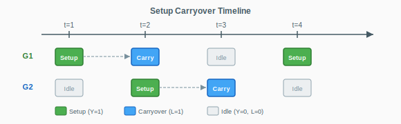
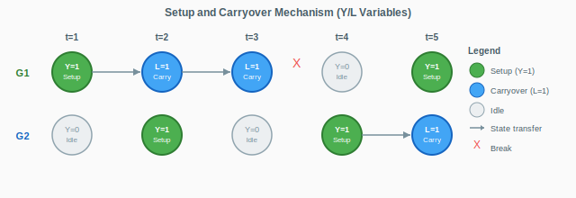
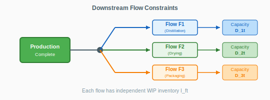
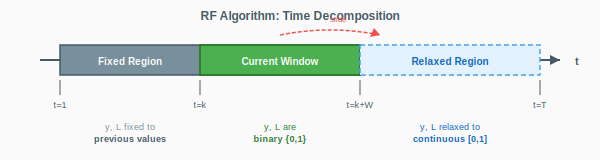
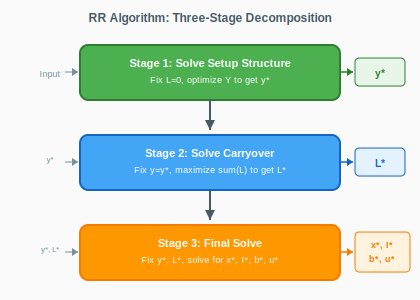
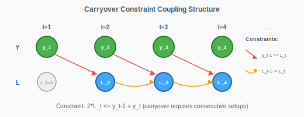

# LS-NTGF-All: 多产品批量计划优化求解器

> 产品大类分组与启动跨期约束下的多周期批量计划问题 (Lot Sizing Problem) 求解器
>
> 算法框架: 时间分解启发式 (RF/RFO) + 三阶段分解 (RR)

---

## 目录

### 第一部分: 工业背景

- 1 [生产背景与问题场景](#1-生产背景与问题场景)
- 2 [核心概念定义](#2-核心概念定义)
- 3 [问题特征与分类](#3-问题特征与分类)

### 第二部分: 数学模型

- 4 [符号定义](#4-符号定义)
- 5 [完整数学模型](#5-完整数学模型)
- 6 [算法一: RF (Relax-and-Fix)](#6-算法一-rf-relax-and-fix)
- 7 [算法二: RFO (RF + Fix-and-Optimize)](#7-算法二-rfo-rf--fix-and-optimize)
- 8 [算法三: RR (Relax-and-Recover)](#8-算法三-rr-relax-and-recover)
- 9 [约束结构分析](#9-约束结构分析)
- 10 [算法比较与选择建议](#10-算法比较与选择建议)

### 第三部分: 代码实现

- 11 [程序架构](#11-程序架构)
- 12 [核心数据结构](#12-核心数据结构)
- 13 [模块功能映射](#13-模块功能映射)
- 14 [构建与运行](#14-构建与运行)

### 附录

- [数值容差](#数值容差)

---

# 第一部分: 工业背景

## 1. 生产背景与问题场景

### 1.1 制造业生产计划挑战

在离散制造业中, 生产计划是连接销售预测与车间执行的核心环节。典型的生产计划需要回答以下问题:

| 决策维度 | 核心问题 | 影响因素 |
|:--------:|:---------|:---------|
| **时间** | 何时生产? | 订单交期、产能周期、库存成本 |
| **数量** | 生产多少? | 需求量、批量经济性、产能限制 |
| **品种** | 生产什么? | 订单优先级、换产成本、工艺约束 |
| **顺序** | 以何顺序? | 启动成本、产品大类相似性、跨期机会 |

### 1.2 典型应用场景

**场景一: 钢铁行业连铸生产**

连铸生产中, 不同钢种需要不同的结晶器配置。更换结晶器(启动)需要耗费大量时间和成本。相似钢种可以归为一个"产品大类", 在连续时间段内生产同族钢种可以避免频繁换产。



<p align="center"><b>图 1: 产品大类启动与跨期时间轴示意</b></p>

**场景二: 化工行业批次生产**

化工反应釜在切换产品类型时需要清洗和重新配置。同类产品可连续生产, 减少切换次数。产品完成后需流向不同的下游工序(精馏、干燥、包装等), 各下游工序有独立的产能限制。

**场景三: 电子元器件SMT生产**

SMT贴片线切换产品需要更换吸嘴、供料器等。相似BOM的产品可以共享设备配置。生产完成后产品流向不同的测试工站, 各工站有不同的处理能力。

### 1.3 问题的实际约束

| 约束类型 | 实际含义 | 数学表达 |
|:--------:|:---------|:---------|
| **产能约束** | 每个周期的设备工时有限 | 总生产时间 + 启动时间 <= 可用工时 |
| **启动约束** | 生产前必须完成启动准备 | 若生产某族产品, 则必须有启动或跨期 |
| **跨期约束** | 只有前期有启动/跨期, 本期才能跨期 | 跨期状态的连续性要求 |
| **排他约束** | 每期最多保持一个族的跨期状态 | 跨期变量的互斥约束 |
| **时间窗约束** | 订单有最早生产期和最晚交付期 | 生产必须在时间窗内 |
| **下游产能** | 产品完成后需流向下游, 受下游产能限制 | 下游处理量 <= 下游产能 |

### 1.4 优化目标

生产计划的优化目标是**最小化总成本**, 包括:

1. **生产成本**: 与生产数量成正比的直接成本
2. **启动成本**: 每次启动产生的固定成本(换模、清洗、调试等)
3. **库存成本**: 在制品库存的持有成本(资金占用、仓储、损耗)
4. **欠交惩罚**: 订单延迟交付产生的违约成本
5. **未满足惩罚**: 订单完全无法满足产生的高额惩罚

**核心权衡**:
- 集中生产 -> 减少启动次数 -> 但增加库存成本
- 分散生产 -> 减少库存成本 -> 但增加启动次数
- 利用跨期 -> 减少启动成本 -> 但限制生产灵活性

---

## 2. 核心概念定义

### 2.1 术语表

| 术语 | 英文 | 定义 |
|:----:|:----:|:-----|
| 订单 | Order / Item | 需要生产的产品需求, 有数量、时间窗等属性 |
| 周期 | Period | 计划时间轴的基本单位, 如班次、天、周 |
| 产品大类 | Product Family / Group | 工艺相似的产品集合, 共享启动状态 |
| 流向 | Flow / Downstream | 产品完成后的下游加工路径 |
| 启动 | Setup | 为生产某产品大类进行的准备工作 |
| 跨期 | Carryover | 相邻周期间保持启动状态, 无需重新启动 |
| 欠交 | Backorder | 订单未能在交期前完成, 延迟交付 |
| 未满足 | Unmet | 订单完全无法在计划期内满足 |

### 2.2 产品大类分组机制

**分组原则**: 工艺相似、换产成本低的产品归为同一族

```
产品大类 G1: [产品A, 产品B, 产品C]  -- 共享启动状态
产品大类 G2: [产品D, 产品E]        -- 共享启动状态
产品大类 G3: [产品F, 产品G, 产品H]  -- 共享启动状态
```

**关键规则**:
- 同一族内的产品在同一周期生产时, 只需一次启动
- 不同族的产品需要各自独立启动
- 启动状态可在相邻周期间跨期保持

### 2.3 启动跨期机制

启动跨期(Setup Carryover)是本问题的核心特征, 允许在相邻周期间保持启动状态:



<p align="center"><b>图 2: Y/L 变量状态转换示意</b></p>

**跨期条件**:
1. 当期要跨期, 前期必须有启动或跨期
2. 每个周期最多只能有一个族处于跨期状态
3. 若某族跨期, 则其他族若要生产必须新启动

**跨期收益**: 跨期替代启动, 节省启动成本

### 2.4 下游流向约束

产品完成生产后流向不同的下游工序, 形成"流向"分类:



<p align="center"><b>图 3: 生产到下游流向的分叉结构</b></p>

**流平衡**: 每个流向有独立的在制品库存, 满足:

$$\text{当期产出} + \text{期初库存} = \text{下游处理量} + \text{期末库存}$$

---

## 3. 问题特征与分类

### 3.1 问题定义

**输入**:
- 订单集合: $N$ 个订单, 每个有需求量、时间窗、所属族、所属流向
- 计划周期: $T$ 个周期, 每个周期有固定产能
- 产品大类: $G$ 个产品大类, 每个有启动成本和启动产能消耗
- 下游流向: $F$ 个流向, 每个有库存成本和各期下游产能

**约束**:
- 产能约束 (生产 + 启动不超过周期产能)
- 启动约束 (生产必须有启动或跨期支撑)
- 跨期约束 (跨期的连续性和排他性)
- 时间窗约束 (生产在允许的时间窗内)
- 下游产能约束 (下游处理不超过下游产能)

**目标**: 最小化总成本 (生产 + 启动 + 库存 + 欠交惩罚 + 未满足惩罚)

### 3.2 问题分类

| 分类维度 | 本问题归类 | 说明 |
|:--------:|:-----------|:-----|
| **模型类型** | 混合整数线性规划 (MILP) | 包含二元变量和连续变量 |
| **复杂度** | NP-Hard | 批量计划问题的一般形式 |
| **规模特征** | 大规模优化 | 实际可达数百订单、数十周期 |
| **问题族** | Capacitated Lot Sizing with Setup Carryover | CLSP-SC 变种 |

### 3.3 求解难点

1. **变量规模**: $O(N \times T + G \times T + F \times T)$ 个决策变量
2. **约束耦合**: 跨期约束形成时间上的链式耦合
3. **Big-M约束**: 启动约束使用Big-M形式, LP松弛弱
4. **多目标权衡**: 启动、库存、欠交成本的平衡

### 3.4 求解策略

由于问题规模大、直接求解困难, 本项目实现三种分解求解算法:

| 算法 | 策略 | 核心思想 |
|:----:|:----:|:---------|
| **RF** | 时间分解 | 滚动时间窗口, 逐步固定决策 |
| **RFO** | RF + 局部搜索 | RF构造初始解, FO局部优化 |
| **RR** | 阶段分解 | 先定启动结构, 再定跨期, 最后定生产 |

---

# 第二部分: 数学模型

## 4. 符号定义

### 4.1 集合与索引

| 符号 | 含义 |
|:----:|:-----|
| $\mathcal{I} = \{1, 2, \ldots, N\}$ | 订单(产品)集合 |
| $\mathcal{T} = \{1, 2, \ldots, T\}$ | 计划周期集合 |
| $\mathcal{G} = \{1, 2, \ldots, G\}$ | 产品大类(分组)集合 |
| $\mathcal{F} = \{1, 2, \ldots, F\}$ | 下游流向集合 |
| $i \in \mathcal{I}$ | 订单索引 |
| $t \in \mathcal{T}$ | 周期索引 |
| $g \in \mathcal{G}$ | 产品大类索引 |
| $f \in \mathcal{F}$ | 流向索引 |

### 4.2 参数

| 符号 | 含义 | 典型值 |
|:----:|:-----|:------:|
| $d_i$ | 订单 $i$ 的需求量 | - |
| $e_i$ | 订单 $i$ 的最早生产期 | - |
| $l_i$ | 订单 $i$ 的最晚交付期 | - |
| $c^{x}_{i}$ | 订单 $i$ 的单位生产成本 | - |
| $c^{y}_{g}$ | 产品大类 $g$ 的启动成本 | - |
| $c^{I}_{f}$ | 流向 $f$ 的单位库存持有成本 | - |
| $c^{b}$ | 单位欠交惩罚 | 100 |
| $c^{u}$ | 未满足惩罚 | 10000 |
| $s^{x}_{i}$ | 订单 $i$ 的单位产能消耗 | - |
| $s^{y}_{g}$ | 产品大类 $g$ 的启动产能消耗 | - |
| $C_t$ | 周期 $t$ 的总产能 | 1440 |
| $D_{ft}$ | 流向 $f$ 在周期 $t$ 的下游处理能力 | - |
| $h_{ig}$ | 订单-族归属: 订单 $i$ 属于族 $g$ 则为 1 | - |
| $k_{if}$ | 订单-流向归属: 订单 $i$ 流向 $f$ 则为 1 | - |

### 4.3 决策变量

| 符号 | 类型 | 含义 |
|:----:|:----:|:-----|
| $x_{it}$ | 连续, $\geq 0$ | 订单 $i$ 在周期 $t$ 的生产量 |
| $y_{gt}$ | 二元, $\in \{0,1\}$ | 产品大类 $g$ 在周期 $t$ 是否启动 |
| $\lambda_{gt}$ | 二元, $\in \{0,1\}$ | 产品大类 $g$ 在周期 $t$ 是否有启动跨期 |
| $I_{ft}$ | 连续, $\geq 0$ | 流向 $f$ 在周期 $t$ 末的在制品库存 |
| $P_{ft}$ | 连续, $\geq 0$ | 流向 $f$ 在周期 $t$ 的下游处理量 |
| $b_{it}$ | 连续, $\geq 0$ | 订单 $i$ 在周期 $t$ 的欠交量 |
| $u_i$ | 二元, $\in \{0,1\}$ | 订单 $i$ 是否完全未满足 |

---

## 5. 完整数学模型

### 5.1 目标函数

最小化总成本 = 生产成本 + 启动成本 + 库存成本 + 欠交惩罚 + 未满足惩罚

$$\min Z = \sum_{i \in \mathcal{I}} \sum_{t \in \mathcal{T}} c^{x}_{i} x_{it} + \sum_{g \in \mathcal{G}} \sum_{t \in \mathcal{T}} c^{y}_{g} y_{gt} + \sum_{f \in \mathcal{F}} \sum_{t \in \mathcal{T}} c^{I}_{f} I_{ft} + \sum_{i \in \mathcal{I}} \sum_{t \geq l_i} c^{b} b_{it} + \sum_{i \in \mathcal{I}} c^{u} u_i$$

### 5.2 约束条件

**约束(1): 需求满足约束**

$$\sum_{t \in \mathcal{T}} x_{it} + u_i \cdot d_i \geq d_i, \quad \forall i \in \mathcal{I}$$

每个订单要么被完全生产, 要么标记为未满足。

**约束(2): 下游工序流平衡**

$$\sum_{i \in \mathcal{I}} k_{if} \cdot x_{it} + I_{f,t-1} - P_{ft} - I_{ft} = 0, \quad \forall f \in \mathcal{F}, \forall t \in \mathcal{T}$$

流向 $f$ 的当期产出 + 期初库存 = 下游处理量 + 期末库存。

**约束(3): 下游处理能力**

$$P_{ft} \leq D_{ft}, \quad \forall f \in \mathcal{F}, \forall t \in \mathcal{T}$$

**约束(4): 终期未满足指示**

$$d_i \cdot u_i \geq b_{i,T}, \quad \forall i \in \mathcal{I}$$

若终期仍有欠交, 则标记为未满足。

**约束(5): 总产能约束**

$$\sum_{i \in \mathcal{I}} s^{x}_{i} \cdot x_{it} + \sum_{g \in \mathcal{G}} s^{y}_{g} \cdot y_{gt} \leq C_t, \quad \forall t \in \mathcal{T}$$

**约束(6): 产品大类启动约束 (Big-M)**

$$\sum_{i: h_{ig}=1} s^{x}_{i} \cdot x_{it} \leq C_t \cdot (y_{gt} + \lambda_{gt}), \quad \forall g \in \mathcal{G}, \forall t \in \mathcal{T}$$

族 $g$ 在周期 $t$ 要生产, 必须有启动或跨期。

**约束(7): 每期最多一个跨期**

$$\sum_{g \in \mathcal{G}} \lambda_{gt} \leq 1, \quad \forall t \in \mathcal{T}$$

**约束(8): 跨期可行性**

$$y_{g,t-1} + \lambda_{g,t-1} - \lambda_{gt} \geq 0, \quad \forall g \in \mathcal{G}, \forall t \geq 2$$

周期 $t$ 要有跨期, 周期 $t-1$ 必须有启动或跨期。

**约束(9): 跨期排他性**

$$\lambda_{gt} + \lambda_{g,t-1} + y_{gt} - \sum_{g' \neq g} y_{g't} \leq 2, \quad \forall g \in \mathcal{G}, \forall t \geq 2$$

防止跨期与其他族的启动冲突。

**约束(10): 初始状态**

$$y_{g,1} = 0, \quad \lambda_{g,1} = 0, \quad \forall g \in \mathcal{G}$$

第一周期没有上期遗留的启动状态。

**约束(11): 时间窗约束**

当 $t < e_i$ 或 $t > l_i$ 时:

$$x_{it} = 0, \quad \forall i \in \mathcal{I}$$

**约束(12): 欠交定义**

$$d_i - \sum_{\tau=1}^{t} x_{i\tau} = b_{it}, \quad \forall i \in \mathcal{I}, \forall t \geq l_i$$

### 5.3 变量域

$$x_{it} \geq 0, \quad y_{gt} \in \{0, 1\}, \quad \lambda_{gt} \in \{0, 1\}, \quad I_{ft} \geq 0, \quad P_{ft} \geq 0, \quad b_{it} \geq 0, \quad u_i \in \{0, 1\}$$

---

## 6. 算法一: RF (Relax-and-Fix)

### 6.1 算法思想

**Relax-and-Fix (RF)** 是一种基于时间分解的启发式算法, 核心思想是:

1. 将时间轴划分为三个动态区域: **已固定区** $T^{fix}$、**当前窗口** $T^{win}$、**放松区** $T^{rel}$
2. 在当前窗口内保持整数约束, 放松区内放松为连续变量
3. 求解子问题后, 固定窗口内的解, 滑动窗口向前推进
4. 迭代直到所有周期都被固定



<p align="center"><b>图 4: RF 算法时间轴三区域划分</b></p>

### 6.2 算法参数

| 参数 | 符号 | 默认值 | 含义 |
|:----:|:----:|:------:|:-----|
| 窗口长度 | $W$ | 6 | 当前求解窗口的周期数 |
| 固定步长 | $S$ | 1 | 每次迭代固定的周期数 |
| 最大重试 | $R$ | 3 | 窗口扩展的最大重试次数 |
| 子问题时限 | - | 60秒 | 每个子问题的CPLEX时间限制 |

### 6.3 子问题 SP(k, W) 定义

给定起始周期 $k$ 和窗口大小 $W$, 定义时间区间:

- $T^{fix} = \{1, 2, \ldots, k-1\}$ (已固定)
- $T^{win} = \{k, k+1, \ldots, k+W-1\}$ (当前窗口)
- $T^{rel} = \{k+W, k+W+1, \ldots, T\}$ (放松区)

子问题中变量类型:
- $t \in T^{fix}$: $y_{gt}, \lambda_{gt}$ 固定为 $\bar{y}_{gt}, \bar{\lambda}_{gt}$
- $t \in T^{win}$: $y_{gt}, \lambda_{gt} \in \{0,1\}$ (二元)
- $t \in T^{rel}$: $y_{gt}, \lambda_{gt} \in [0,1]$ (连续松弛)
- $u_i$: 在迭代过程中放松为连续, 最终求解时恢复二元

### 6.4 算法流程

```
输入: 问题数据, 参数 W, S, R
输出: 可行解 (y*, lambda*, x*, ...)

1. 初始化:
   k = 1, W_current = W
   y_bar[g][t] = 0, lambda_bar[g][t] = 0 for all g, t

2. 主循环 (while k <= T):
   2.1 求解子问题 SP(k, W_current)

   2.2 if 求解成功:
       固定周期 [k, k+S) 的 y, lambda 值
       k = k + S
       W_current = W  // 重置窗口大小
   else:
       for retry = 1 to R:
           W_current = W_current + 1
           求解 SP(k, W_current)
           if 成功: break

       if 仍失败:
           回滚最近一次固定
           W_current = W + 2

3. 最终求解:
   固定所有 y, lambda
   恢复 u 为二元变量
   求解完整模型得到 x*, I*, b*, u*

4. 返回解
```

### 6.5 算法特点

**优点**:
- 实现简单, 易于理解
- 每个子问题规模小, 求解快
- 能处理大规模实例

**缺点**:
- 解质量依赖于固定顺序
- 早期决策可能导致后期不可行
- 没有后续优化机制

---

## 7. 算法二: RFO (RF + Fix-and-Optimize)

### 7.1 算法思想

**RFO** 是 RF 的增强版本, 在 RF 构造初始解后, 使用 **Fix-and-Optimize (FO)** 进行局部搜索优化:

1. **阶段1 (RF)**: 使用 RF 算法构造初始可行解
2. **阶段2 (FO)**: 滑动窗口局部优化, 改进解质量
3. **阶段3 (Final)**: 固定所有二元变量, 求解最终生产计划

### 7.2 FO 阶段参数

| 参数 | 符号 | 默认值 | 含义 |
|:----:|:----:|:------:|:-----|
| FO窗口长度 | $W_o$ | 8 | FO优化窗口大小 |
| FO步长 | $S_o$ | 3 | FO窗口滑动步长 |
| 最大轮数 | $H$ | 2 | FO优化的最大轮数 |
| 边界缓冲 | $\Delta$ | 1 | 窗口边界的缓冲周期 |
| 子问题时限 | - | 30秒 | FO子问题时间限制 |

### 7.3 FO 邻域子问题 NSP(a)

给定窗口起点 $a$, 定义扩展窗口:

$$WND^{+}(a) = [\max(1, a - \Delta), \min(T, a + W_o + \Delta))$$

邻域子问题中:
- $t \in WND^{+}(a)$: $y_{gt}, \lambda_{gt} \in \{0,1\}$ (二元, 可优化)
- $t \notin WND^{+}(a)$: $y_{gt}, \lambda_{gt}$ 固定为当前最优值

### 7.4 算法流程

```
输入: 问题数据, RF参数, FO参数
输出: 优化后的解

===== 阶段1: RF =====
1. 执行 RF 算法得到初始解
   y_current, lambda_current, objective_current

===== 阶段2: FO =====
2. for h = 1 to H:
   improved = false

   for a = 0, S_o, 2*S_o, ... < T:
       2.1 求解 NSP(a)
       2.2 if 新目标 < objective_current - epsilon:
           更新 y_current, lambda_current
           objective_current = 新目标
           improved = true

   if not improved:
       break  // 无改进则提前终止

===== 阶段3: Final =====
3. 固定所有 y_current, lambda_current
4. 求解完整模型得到 x*, I*, b*, u*
5. 返回解
```

### 7.5 算法特点

**优点**:
- 在 RF 基础上显著改进解质量
- FO 阶段能逃离局部最优
- 多轮优化确保充分改进

**缺点**:
- 计算时间比 RF 长
- 改进幅度随轮次递减
- 窗口大小需要调优

---

## 8. 算法三: RR (Relax-and-Recover)

### 8.1 算法思想

**Relax-and-Recover (RR)** 是一种三阶段分解算法:

1. **Stage 1**: 固定 $\lambda = 0$, 求解启动结构 $y^{*}$
2. **Stage 2**: 固定 $y^{*}$, 最大化跨期变量 $\lambda^{*}$
3. **Stage 3**: 固定 $y^{*}$ 和 $\lambda^{*}$, 求解最终生产计划



<p align="center"><b>图 5: RR 算法三阶段分解流程</b></p>

### 8.2 Stage 1: 求解启动结构

**目标**: 在无跨期约束下, 确定最优的启动模式 $y^{*}$

**模型特点**:
- 移除所有 $\lambda$ 变量 (等价于 $\lambda_{gt} = 0, \forall g, t$)
- 产能可选择放大 (默认系数 1.0, 不放大)
- Big-M 约束简化为:

$$\sum_{i: h_{ig}=1} s^{x}_{i} \cdot x_{it} \leq C_t \cdot y_{gt}$$

**输出**: $y^{*}_{gt}$ 对于所有 $g, t$ (启动决策)

### 8.3 Stage 2: 求解跨期变量

**目标**: 在给定 $y^{*}$ 下, 最大化跨期次数

$$\max \sum_{g \in \mathcal{G}} \sum_{t \in \mathcal{T}} \lambda_{gt}$$

**约束**:

**(a) 固定启动**:

$$y_{gt} = y^{*}_{gt}, \quad \forall g, t$$

**(b) 初始状态**:

$$\lambda_{g,1} = 0, \quad \forall g$$

**(c) 每期最多一个跨期**:

$$\sum_{g \in \mathcal{G}} \lambda_{gt} \leq 1, \quad \forall t$$

**(d) 跨期连续性**:

$$2\lambda_{gt} \leq y^*_{g,t-1} + y^*_{gt}, \quad \forall g, \forall t \geq 2$$

只有当 $y^*_{g,t-1} = 1$ 且 $y^*_{gt} = 1$ 时, $\lambda_{gt}$ 才能为 1。

**输出**: $\lambda^*_{gt}$ 对于所有 $g, t$ (跨期决策)

### 8.4 Stage 3: 最终求解

**目标**: 固定二元变量, 求解连续变量的最优配置

**固定规则**:
- 若 $\lambda^*_{gt} = 1$, 则 $y_{gt} = 0$ (跨期替代启动)
- 否则 $y_{gt} = y^*_{gt}$

**求解**: 完整的 MILP 模型, 但 $(y, \lambda)$ 已固定, 问题退化为 LP 或小规模 MIP

**输出**: 完整的生产计划 $(x^*, I^*, P^*, b^*, u^*)$

### 8.5 算法流程

```
输入: 问题数据, CPLEX参数
输出: 最终解

===== Stage 1 =====
1. 构建无跨期模型 (lambda = 0)
2. 求解得到 y*
3. 记录 Stage1 目标值和统计

===== Stage 2 =====
4. 构建跨期优化模型
5. 固定 y = y*
6. 最大化 sum(lambda)
7. 求解得到 lambda*

===== Stage 3 =====
8. 构建完整模型
9. 固定 y (考虑跨期替代) 和 lambda = lambda*
10. 求解最终生产计划
11. 返回解和指标
```

### 8.6 RR 算法的跨期机制问题

**已知问题**: Stage 2 可能发现 0 个跨期机会

**原因分析**:
- Stage 1 如果使用产能放大策略, 会导致启动稀疏
- 启动稀疏意味着很少有连续两个周期对同一族启动
- Stage 2 的跨期条件 $2\lambda_{gt} \leq y^*_{g,t-1} + y^*_{gt}$ 要求连续启动
- 无连续启动则无跨期机会

**修复方案**:
1. 降低产能放大系数 (从 10.0 降至 2.0-3.0)
2. 在 Stage 1 添加连续启动激励项
3. 实施迭代策略: 若无连续启动则调整参数重试

### 8.7 算法特点

**优点**:
- 分解清晰, 每阶段目标明确
- Stage 2 是小规模纯整数规划, 求解快
- 能找到较多的跨期机会, 节省启动成本

**缺点**:
- Stage 1 的决策对后续影响大
- 无法修正 Stage 1 中的次优决策
- 最终目标值可能劣于直接求解

---

## 9. 约束结构分析

### 9.1 约束分类

| 约束 | 涉及变量 | 类型 | 紧致性 |
|:----:|:--------:|:----:|:------:|
| 需求满足 | $x, u$ | 线性 | 通常紧 |
| 流平衡 | $x, I, P$ | 线性等式 | 始终紧 |
| 下游能力 | $P$ | 线性 | 部分紧 |
| 总产能 | $x, y$ | 线性 | 关键紧 |
| 家族Big-M | $x, y, \lambda$ | 大M | 决定性 |
| 跨期约束 | $y, \lambda$ | 线性 | 结构性 |
| 时间窗 | $x$ | 边界 | 强制 |
| 欠交定义 | $x, b$ | 线性等式 | 定义性 |

### 9.2 Big-M 约束的影响

Big-M 约束 $\sum_i s^{x}_{i} x_{it} \leq C_t (y_{gt} + \lambda_{gt})$ 是模型的核心:

- **当 $y_{gt} + \lambda_{gt} = 0$**: 该族不能生产任何产品
- **当 $y_{gt} + \lambda_{gt} = 1$**: 产能上限为 $C_t$, 与总产能约束一致
- **M值选择**: 使用 $C_t$ 作为 M 值, 已是最紧的合理选择

### 9.3 跨期约束的耦合性

跨期约束 (7)-(9) 形成时间上的耦合:



<p align="center"><b>图 6: Y-L 变量链式依赖结构</b></p>

这种链式结构使得:
- 早期周期的启动决策影响后续所有周期的跨期可能性
- 跨期一旦中断, 需要重新启动才能继续

---

## 10. 算法比较与选择建议

### 10.1 性能对比

| 指标 | RF | RFO | RR |
|:----:|:--:|:---:|:--:|
| **求解速度** | 快 | 中 | 快 |
| **解质量** | 中 | 高 | 中-高 |
| **稳定性** | 高 | 高 | 中 |
| **可扩展性** | 好 | 好 | 好 |
| **参数敏感** | 中 | 高 | 低 |

### 10.2 选择建议

**选择 RF 当**:
- 需要快速获得可行解
- 问题规模大, 计算资源有限
- 解质量要求不高

**选择 RFO 当**:
- 追求最优解质量
- 有足够的计算时间
- RF 解质量不满意

**选择 RR 当**:
- 跨期节省是重要目标
- 问题有明显的阶段性结构
- 需要理解启动-跨期关系

### 10.3 典型结果范围

基于测试经验, 对于典型规模 (N=100, T=30, G=5, F=5):

| 算法 | 目标值范围 | 求解时间 |
|:----:|:---------:|:--------:|
| RF | 580K - 620K | 5 - 15 秒 |
| RFO | 570K - 600K | 15 - 60 秒 |
| RR | 575K - 610K | 10 - 30 秒 |

---

# 第三部分: 代码实现

## 11. 程序架构

### 11.1 技术栈

| 项目 | 说明 |
|:----:|:-----|
| 编程语言 | C++17 |
| 编译器 | MSVC (Visual Studio 2022) |
| 构建系统 | CMake 3.15+ |
| 优化求解器 | IBM CPLEX 22.1.1 |
| 运行平台 | Windows x64 |

### 11.2 目录结构

```
LS-NTGF-All/
+-- CMakeLists.txt              # CMake 构建配置
+-- CMakePresets.json           # 构建预设 (vs2022-release 等)
+-- README.md                   # 本文件
+-- data/                       # 测试数据文件
+-- logs/                       # 运行日志输出
+-- results/                    # 求解结果输出
+-- docs/                       # 技术文档
|   +-- *_数学模型与算法分析.md  # 数学模型文档
|   +-- *_RR算法跨期机制问题分析.md  # 算法问题分析
+-- src/
    +-- main.cpp                # 程序入口, 命令行解析
    +-- optimizer.h             # 核心数据结构和函数声明
    +-- common.h                # 工具函数和类型定义
    +-- input.cpp               # CSV数据文件读取
    +-- output.cpp              # JSON/CSV结果输出
    +-- cplex_lot_sizing.cpp    # CPLEX完整模型直接求解
    +-- big_order.cpp           # 订单合并(流向-分组策略)
    +-- case_analysis.cpp       # 批量算例分析工具
    +-- logger.h                # 日志系统头文件
    +-- logger.cpp              # 日志系统实现
    +-- tee_stream.h            # CPLEX日志双向输出流
    +-- solvers/
        +-- rf_solver.cpp       # RF 算法实现
        +-- rfo_solver.cpp      # RFO 算法实现
        +-- rr_solver.cpp       # RR 算法实现
```

---

## 12. 核心数据结构

### 12.1 数学模型到代码的映射

| 数学符号 | 代码结构 | 说明 |
|:--------:|:--------:|:-----|
| $d_i, e_i, l_i$ | `Order` 结构体 | 订单需求量、时间窗 |
| $c^x_i, s^x_i$ | `Order` 结构体 | 订单成本、产能消耗 |
| $c^y_g, s^y_g$ | `cost_y[]`, `usage_y[]` | 族启动参数 |
| $c^I_f$ | `cost_i[]` | 流向库存成本 |
| $h_{ig}, k_{if}$ | `Order::group`, `Order::flow` | 订单归属 |
| $C_t, D_{ft}$ | `capacity`, `demand_downstream[]` | 产能参数 |
| 决策变量 | CPLEX `IloNumVarArray` | 求解变量 |

### 12.2 订单数据结构

```cpp
struct Order {
    int order_id;       // 订单编号
    int group;          // 所属产品大类 g
    int flow;           // 所属流向 f
    double demand;      // 需求量 d_i
    int earliest;       // 最早生产期 e_i
    int latest;         // 最晚交付期 l_i
    double usage;       // 单位产能消耗 s^x_i
    double cost;        // 单位生产成本 c^x_i
};
```

### 12.3 问题数据结构

```cpp
struct ProblemData {
    // 基本维度
    int N;              // 订单数
    int T;              // 周期数
    int G;              // 产品大类数
    int F;              // 流向数

    // 参数
    double capacity;                        // 周期产能 C_t
    vector<double> cost_y;                  // 启动成本 c^y_g
    vector<double> cost_i;                  // 库存成本 c^I_f
    vector<double> usage_y;                 // 启动产能 s^y_g
    vector<vector<double>> demand_downstream; // 下游产能 D_{ft}

    // 订单列表
    vector<Order> orders;

    // 惩罚参数
    double penalty_unmet;     // 未满足惩罚 c^u
    double penalty_backorder; // 欠交惩罚 c^b
};
```

### 12.4 求解结果结构

```cpp
struct SolveResult {
    // 状态
    string algorithm;       // 算法名称
    double objective;       // 目标值
    double solve_time;      // 求解时间
    double gap;             // MIP Gap

    // 决策变量
    vector<vector<double>> Y;  // 启动 y_{gt}
    vector<vector<double>> L;  // 跨期 lambda_{gt}
    vector<vector<double>> X;  // 生产 x_{it}
    vector<vector<double>> I;  // 库存 I_{ft}
    vector<vector<double>> B;  // 欠交 b_{it}
    vector<double> U;          // 未满足 u_i

    // 指标
    double cost_production;
    double cost_setup;
    double cost_inventory;
    double cost_backorder;
    double cost_unmet;
    int total_setups;
    int total_carryovers;
    double saved_setup_cost;
    int unmet_count;
    double unmet_rate;
};
```

---

## 13. 模块功能映射

### 13.1 数学模型到代码模块的映射

| 数学模型/功能 | 代码模块 | 文件 |
|:-------------:|:--------:|:----:|
| 完整 MILP 模型 | `SolveCplexDirect()` | cplex_lot_sizing.cpp |
| RF 算法 | `SolveRF()` | solvers/rf_solver.cpp |
| RFO 算法 | `SolveRFO()` | solvers/rfo_solver.cpp |
| RR 算法 | `SolveRR()` | solvers/rr_solver.cpp |
| 数据读取 | `LoadInput()` | input.cpp |
| 结果输出 | `WriteOutput()` | output.cpp |
| 订单合并 | `MergeOrders()` | big_order.cpp |
| 日志系统 | `Logger` | logger.h/cpp |

### 13.2 算法流程

```
main.cpp
    |
    +-> ParseArgs()           // 解析命令行参数
    +-> LoadInput()           // 读取 CSV 数据文件
    +-> MergeOrders()         // 可选: 订单合并预处理
    |
    +-> 算法选择:
    |       |
    |       +-> SolveRF()     // RF 算法
    |       +-> SolveRFO()    // RFO 算法
    |       +-> SolveRR()     // RR 算法
    |
    +-> WriteOutput()         // 输出 JSON 结果
    +-> WriteLog()            // 输出日志文件
```

### 13.3 RF 算法流程

```
SolveRF()
    |
    +-> 初始化 CPLEX 环境
    +-> WHILE 未完成所有周期:
    |       |
    |       +-> BuildSubproblem(k, W)    // 构建子问题
    |       +-> ConfigureVariables()     // 设置变量类型
    |       +-> SolveSubproblem()        // CPLEX 求解
    |       +-> FixSolution(k, S)        // 固定窗口解
    |       +-> k = k + S                // 滑动窗口
    |
    +-> SolveFinal()          // 固定所有二元变量求解
    +-> ExtractSolution()     // 提取结果
```

### 13.4 RR 算法流程

```
SolveRR()
    |
    +-> Stage1: SolveSetupStructure()
    |       |
    |       +-> 构建无跨期模型
    |       +-> 求解得到 y*
    |
    +-> Stage2: SolveCarryover()
    |       |
    |       +-> 固定 y = y*
    |       +-> 最大化 sum(lambda)
    |       +-> 求解得到 lambda*
    |
    +-> Stage3: SolveFinal()
            |
            +-> 固定 y*, lambda*
            +-> 求解生产计划
            +-> 提取结果
```

---

## 14. 构建与运行

### 14.1 环境要求

- Windows 10/11 x64
- Visual Studio 2022 (MSVC 编译器)
- CMake 3.15+
- IBM CPLEX Optimization Studio 22.1.1

### 14.2 CPLEX 配置

确保 CPLEX 安装在 `D:/CPLEX` 目录, 或修改 CMakeLists.txt 中的路径:

```cmake
set(CPLEX_ROOT "D:/CPLEX")
```

关键路径:
- 头文件: `D:/CPLEX/cplex/include`, `D:/CPLEX/concert/include`
- 库文件: `D:/CPLEX/cplex/lib/x64_windows_msvc14/stat_mda`

### 14.3 构建命令

```powershell
# 配置
cmake --preset vs2022-release

# 编译
cmake --build --preset vs2022-release

# 可执行文件位置
# build/vs2022/bin/Release/LS-NTGF-All.exe
```

### 14.4 命令行参数

```
LS-NTGF-All.exe [选项] [数据文件]

算法选择:
  --algo=RF           Relax-and-Fix (默认)
  --algo=RFO          RF + Fix-and-Optimize
  --algo=RR           Relax-and-Recover 三阶段分解

选项:
  -f, --file <路径>       输入数据文件
  -o, --output <目录>     输出目录 (默认: ./results)
  -l, --log <文件>        日志文件路径 (默认: ./logs/solve.log)
  -t, --time <秒>         CPLEX时间限制 (默认: 30)
  --u-penalty <整数>      未满足惩罚 (默认: 10000)
  --b-penalty <整数>      欠交惩罚 (默认: 100)
  --threshold <小数>      大订单阈值 (默认: 1000)
  --no-merge              禁用订单合并
  --cplex-workdir <路径>  CPLEX工作目录 (默认: D:\CPLEX_Temp)
  --cplex-workmem <MB>    CPLEX内存限制 (默认: 4096)
  --cplex-threads <数量>  CPLEX线程数, 0=自动 (默认: 0)
  -h, --help              显示帮助信息
```

### 14.5 使用示例

```powershell
# 使用 RF 算法求解
LS-NTGF-All.exe --algo=RF data.csv

# 使用 RFO 算法, 时间限制60秒
LS-NTGF-All.exe --algo=RFO -t 60 data.csv

# 使用 RR 算法, 指定输出目录
LS-NTGF-All.exe --algo=RR --output=./out data.csv
```

### 14.6 输入数据格式

CSV 文件结构:

```csv
case_id,<算例名称>
T,<周期数>
F,<流向数>
G,<分组数>
cost_y,<启动成本_g1>,<启动成本_g2>,...
cost_i,<库存成本_f1>,<库存成本_f2>,...
usage_y,<启动产能_g1>,<启动产能_g2>,...
N,<订单数>
demand_f1,<需求_f1_t1>,<需求_f1_t2>,...
demand_f2,<需求_f2_t1>,<需求_f2_t2>,...
...
order_1,<编号>,<分组>,<流向>,<需求量>,<最早期>,<最晚期>,<产能消耗>,<生产成本>
order_2,...
...
```

### 14.7 输出格式

JSON 结果文件包含:

```json
{
  "summary": {
    "algorithm": "RF|RFO|RR",
    "input_file": "...",
    "objective": 579709.00,
    "total_time": 12.345,
    "solve_time": 10.234,
    "gap": 0.001234
  },
  "problem": {
    "N": 100, "T": 30, "F": 5, "G": 5, "capacity": 1440
  },
  "metrics": {
    "cost": {
      "production": 12345.00,
      "setup": 45000.00,
      "inventory": 8900.00,
      "backorder": 5000.00,
      "unmet": 500000.00
    },
    "setup_carryover": {
      "total_setups": 15,
      "total_carryovers": 8,
      "saved_setup_cost": 24000.00
    },
    "demand": {
      "total_demand": 50000,
      "unmet_count": 5,
      "unmet_rate": 0.05,
      "on_time_rate": 0.92
    },
    "capacity": {
      "avg_utilization": 0.85,
      "max_utilization": 0.98,
      "by_period": [0.82, 0.91, ...]
    }
  },
  "variables": {
    "Y": { "dimensions": [5, 30], "data": [[...], ...] },
    "L": { "dimensions": [5, 30], "data": [[...], ...] },
    "X": { "dimensions": [100, 30], "data": [[...], ...] },
    "I": { "dimensions": [5, 30], "data": [[...], ...] },
    "B": { "dimensions": [100, 30], "data": [[...], ...] },
    "U": { "dimensions": [100], "data": [...] }
  }
}
```

### 14.8 GUI 集成

本求解器设计用于与 **LS-NTGF-GUI** 配合使用, GUI 提供:
- 可视化问题实例生成
- 算法选择和参数调优
- 实时求解进度监控
- 结果可视化 (热力图、图表、变量浏览器)

供 GUI 解析的状态码:
- `[LOAD:OK:N:T:F:G]` - 数据加载成功
- `[MERGE:合并前:合并后]` - 订单合并完成
- `[STAGE:n:START]` / `[STAGE:n:DONE:目标值:时间:间隙]` - 阶段进度
- `[DONE:SUCCESS]` - 求解完成

---

# 附录

## 数值容差

| 参数 | 值 | 用途 |
|:----:|:--:|:-----|
| 整数判别阈值 | $10^{-6}$ | 判断变量是否为整数 |
| 零值容差 | $10^{-10}$ | 判断变量是否为零 |
| 目标改进阈值 | $10^{-4}$ | FO 阶段判断是否有改进 |

